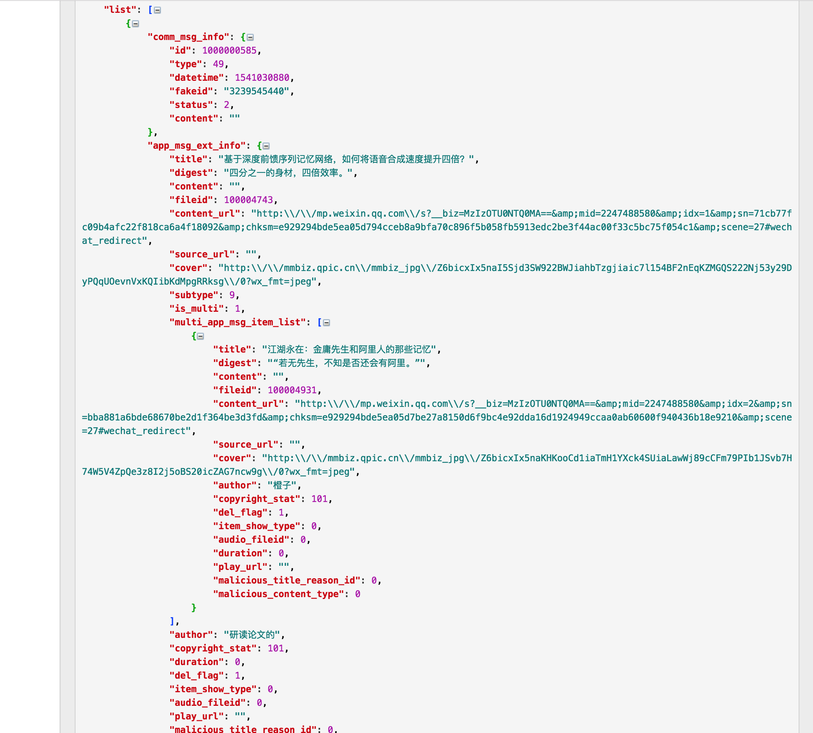
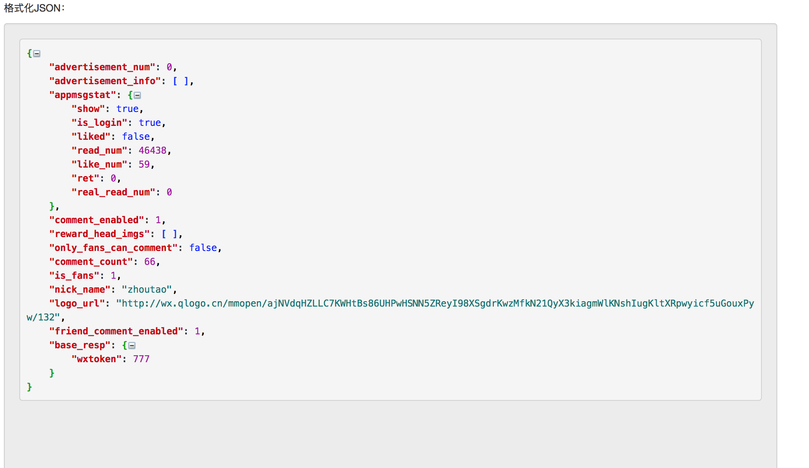
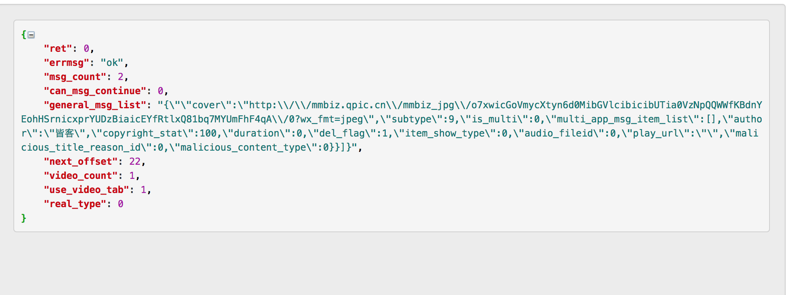

## 开发文档

### 微信公众号文章相关服务

#### 公众号历史文章列表静态页面

url：`/mp/profile_ext?action=home`

说明：返回静态页面html，页面中注入自动下一页的脚本，并在没有下一页时，自动开始文章详情聊取，第一页需要在html中使用正则提取列表数据，其后都通过接口获取

#### 公众号历史文章列表下一页接口

url ：`/mp/profile_ext?action=getmsg`

#### 公众号文章静态页面

url ： `/s?__biz=`

说明：返回静态html，在该http报文中注入了自动刷新和自动跳转到下一篇未更新信息的文章的js脚本，实现自动浏览获取数据。

#### 公众号文章阅读、点赞数等接口

url ： `/mp/getappmsgext`

#### 公众号备注相关信息接口

url ： `/mp/appmsg_comment?action=getcommen`

